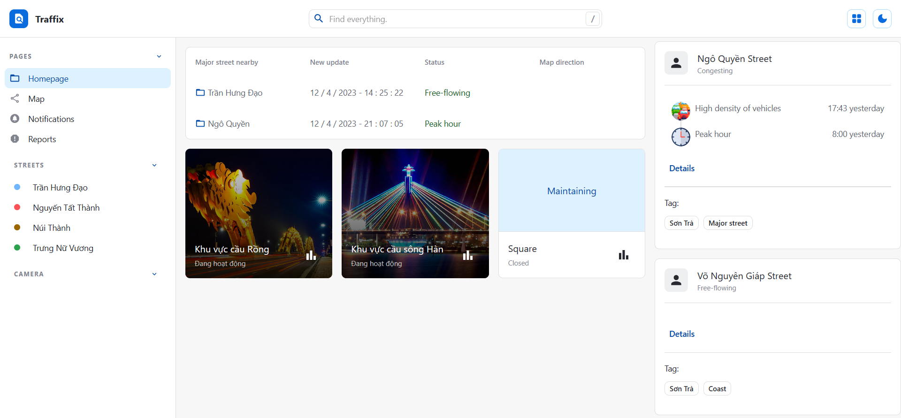
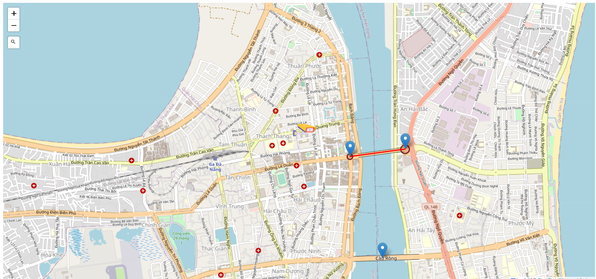
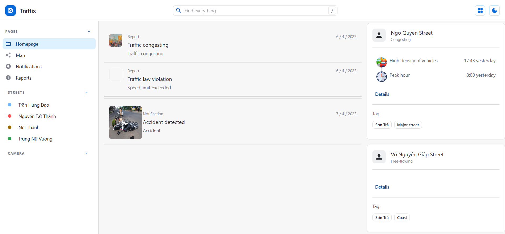
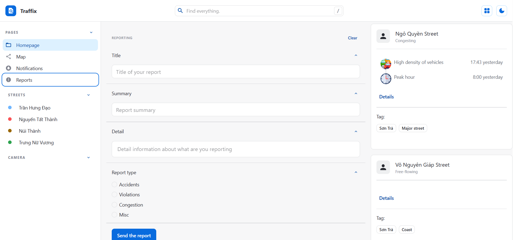
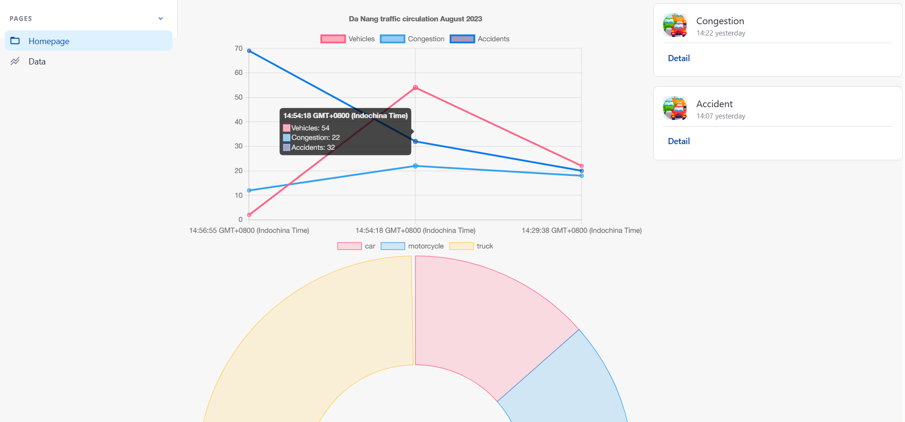

<a name="readme-top"></a>

[![Contributors][contributors-shield]][contributors-url]
[![Forks][forks-shield]][forks-url]
[![Stargazers][stars-shield]][stars-url]
[![Issues][issues-shield]][issues-url]
[![MIT License][license-shield]][license-url]

<br />
<div align="center">
<h3 align="center">Traffix Web Client</h3>

<p align="center">
    A web server that associated with the <strong> Traffix </strong> traffic management, allow user to observe and interact with the city transit network
    <br />
    <br />
    <a href="https://github.com/notabota/traffix_web">View Demo</a>
    ·
    <a href="https://github.com/notabota/traffix_web/issues">Report Bug</a>
    ·
    <a href="https://github.com/notabota/traffix_web/issues">Request Feature</a>
  </p>
</div>

<!-- TABLE OF CONTENTS -->

<details>
  <summary>Table of Contents</summary>
  <ol>
    <li>
      <a href="#about-the-project">About The Project</a>
      <ul>
        <li><a href="#built-with">Built With</a></li>
      </ul>
    </li>
    <li>
      <a href="#getting-started">Getting Started</a>
      <ul>
        <li><a href="#prerequisites">Prerequisites</a></li>
        <li><a href="#installation">Installation</a></li>
      </ul>
    </li>
    <li><a href="#usage">Usage</a></li>
    <li><a href="#roadmap">Roadmap</a></li>
    <li><a href="#contributing">Contributing</a></li>
    <li><a href="#contact">Contact</a></li>
  </ol>
</details>

<!-- ABOUT THE PROJECT -->

## About The Project

This website is a part of the **Traffix - Traffic Management System**. It provide the client the ability to monitor the
congestion activities on the local map, watch real-time object detection camera, get updated notifications about events
such as traffic jam or accident, and even have a statical page to visualize information about the city transit network.

Main functionality:

* Traffic network map, with detail information about traffic congestion activities.
* Real-time camera view, include object detection.
* Notifications and report
* Visualized information pages with graph and chart

<p style="text-align: right;"><a href="#readme-top">back to top</a></p>

### Built With

#### Frontend

* [![MUI Joy][MUI]][MUI Joy-url]

* [![React][React.js]][React-url]

#### Backend. tools and framework

* [![Firebase]][Firebase-url]

* [![Vite]][Vite-url]

* [Leaflet][Leaflet-url]

<p style="text-align: right;"><a href="#readme-top">back to top</a></p>

<!-- GETTING STARTED -->

## Getting Started

To get a local copy up and running follow these simple example steps. Note that you have to have a running **Traffix**
system running on your local for the application to work.

### Prerequisites

First step is to install required dependencies

```sh
npm install npm@latest -g
```

You also need to have a active Firebase account, because in this project, I use Firestore as a database management
solution. After getting your authentication key, change the ```firebaseConfig``` varibles in your ```src/main.tsx```
file
to your json path.

```js
import firebaseKey from "../FIREBASE.json"

const firebaseConfig = firebaseKey;
```

### Installation

No installation is needed after completed prerequisites, all you need to do is run this command in the root directory:

```sh
npm run start
```

See ```package.json``` for more options of how you could build or preview this application.

<p style="text-align: right;"><a href="#readme-top">back to top</a></p>

<!-- USAGE EXAMPLES -->

## Usage

#### Homepage



#### Map



#### Notifications



#### Reports



#### Statistics



<p style="text-align: right;"><a href="#readme-top">back to top</a></p>

<!-- ROADMAP -->

## Roadmap

- [X]  Layout design
- [X]  Integrate with the database
- [X]  Real-time notification
- [ ]  City street network knowledge base
- [ ]  Create a tag system
- [ ]  Add useful visual components to map
- [ ]  Multi-language support

See the [open issues](https://github.com/notabota/traffix_web/issues) for a full list of proposed features (and known
issues).

<p style="text-align: right;"><a href="#readme-top">back to top</a></p>

<!-- CONTRIBUTING -->

## Contributing

Contributions are what make the open source community such an amazing place to learn, inspire, and create. Any
contributions you make are **greatly appreciated**.

If you have a suggestion that would make this better, please fork the repo and create a pull request. You can also
simply open an issue with the tag "enhancement".

1. Fork the Project
2. Create your Feature Branch (`git checkout -b feature/AmazingFeature`)
3. Commit your Changes (`git commit -m 'Add some AmazingFeature'`)
4. Push to the Branch (`git push origin feature/AmazingFeature`)
5. Open a Pull Request

<p style="text-align: right;"><a href="#readme-top">back to top</a></p>

## Contact

Nguyễn Nguyên Vũ

* [![Gmail][gmail]]() - **nnv2205owo@gmail.com**
* [![Facebook][facebook]](https://www.facebook.com/nnv2205owo/) - **facebook.com/nnv2205owo**
* [![LinkedIn][linkedin]](https://www.linkedin.com/in/nnv2205owo/) - **linkedin.com/in/nnv2205owo**
* [![Upwork][upwork]](https://www.upwork.com/freelancers/~012078434f80806fe1) - **upwork.com/freelancers/~
  012078434f80806fe1**

Project Link: [https://github.com/notabota/traffix_web](https://github.com/notabota/traffix_web)

<p style="text-align: right;"><a href="#readme-top">back to top</a></p>

<!-- MARKDOWN LINKS & IMAGES -->

[MUI]: https://img.shields.io/badge/MUI-%230081CB.svg?style=for-the-badge&logo=mui&logoColor=white

[MUI Joy-url]: https://mui.com/joy-ui/getting-started/

[React.js]: https://img.shields.io/badge/React-20232A?style=for-the-badge&logo=react&logoColor=61DAFB

[React-url]: https://reactjs.org/

[Firebase]: https://img.shields.io/badge/firebase-%23039BE5.svg?style=for-the-badge&logo=firebase

[Firebase-url]: https://firebase.google.com/

[Vite]: https://img.shields.io/badge/vite-%23646CFF.svg?style=for-the-badge&logo=vite&logoColor=white

[Vite-url]: https://vitejs.dev/

[Leaflet-url]: https://leafletjs.com/

[contributors-shield]: https://img.shields.io/github/contributors/notabota/traffix_web.svg?style=for-the-badge

[contributors-url]: https://github.com/notabota/traffix_web/graphs/contributors

[forks-shield]: https://img.shields.io/github/forks/notabota/traffix_web.svg?style=for-the-badge

[forks-url]: https://github.com/notabota/traffix_web/network/members

[stars-shield]: https://img.shields.io/github/stars/notabota/traffix_web.svg?style=for-the-badge

[stars-url]: https://github.com/notabota/traffix_web/stargazers

[issues-shield]: https://img.shields.io/github/issues/notabota/traffix_web.svg?style=for-the-badge

[issues-url]: https://github.com/notabota/traffix_web/issues

[license-shield]: https://img.shields.io/github/license/notabota/traffix_web.svg?style=for-the-badge

[license-url]: https://github.com/notabota/traffix_web/blob/master/LICENSE.txt

[linkedin-shield]: https://img.shields.io/badge/-LinkedIn-black.svg?style=for-the-badge&logo=linkedin&colorB=555

[linkedin-url]: https://linkedin.com/in/nnv2205owo

[facebook]: https://img.shields.io/badge/Facebook-1877F2?style=for-the-badge&logo=facebook&logoColor=white

[gmail]: https://img.shields.io/badge/Gmail-D14836?style=for-the-badge&logo=gmail&logoColor=white

[linkedin]: https://img.shields.io/badge/LinkedIn-0077B5?style=for-the-badge&logo=linkedin&logoColor=white

[upwork]: https://img.shields.io/badge/UpWork-6FDA44?style=for-the-badge&logo=Upwork&logoColor=white
